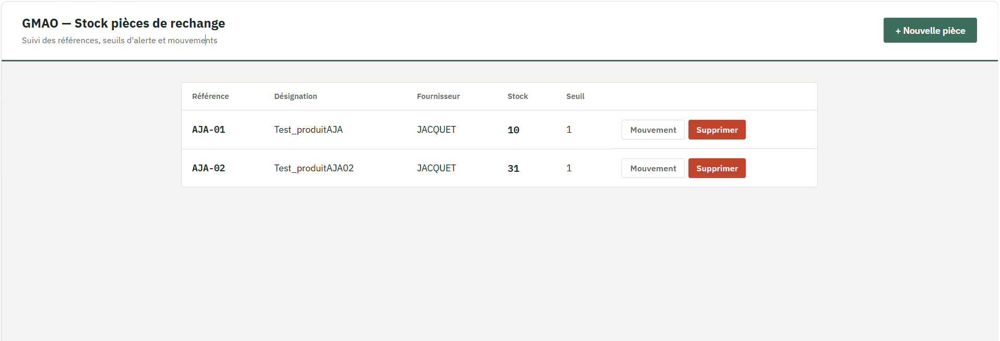

# GMAO — Gestion de stock de pièces de rechange


Petite application de GMAO (Gestion de Maintenance Assistée par Ordinateur) permettant de suivre un stock de pièces de rechange : ajout de références, mouvements d'entrée/sortie, alerte automatique en cas de stock sous le seuil critique.

**Rapport de tests en ligne (mis à jour automatiquement à chaque push) :**
👉 https://alexis-pro-ui.github.io/gmao-portfolio/

## 🎯 Pourquoi ce projet

Testeur logiciel (ISTQB Foundation) avec plusieurs années d'expérience terrain, notamment sur des systèmes de pilotage logistique (WCS, hypervision), je voulais construire un projet complet et réaliste pour démontrer concrètement mes compétences en **test logiciel et automatisation** — au-delà de la théorie.

Ce projet couvre l'ensemble de la chaîne :
- Une application fonctionnelle réelle (pas juste une maquette)
- Une suite de tests automatisés (UI + API)
- Une pipeline d'intégration continue (CI/CD)
- Des rapports de test professionnels, publiés automatiquement

L'application elle-même a été développée avec l'assistance de l'IA (Claude) — utilisée comme un véritable outil de productivité, avec une compréhension complète du code produit et des choix techniques faits à chaque étape.

## 🖼️ Aperçu

 

## 🛠️ Stack technique

| Composant | Techno |
|---|---|
| Back-end / API | Python, FastAPI, SQLModel |
| Base de données | SQLite |
| Front-end | HTML / CSS / JavaScript vanilla |
| Tests API | pytest, requests |
| Tests UI | Playwright (Python) |
| Rapports | Allure Report |
| CI/CD | GitHub Actions |
| Hébergement des rapports | GitHub Pages |

## ✅ Fonctionnalités

- CRUD complet des pièces de rechange (référence, désignation, fournisseur)
- Enregistrement des mouvements de stock (entrée / sortie) avec historique
- Alerte visuelle automatique si le stock passe sous le seuil défini
- Règles métier appliquées et testées : référence unique, impossibilité de sortir plus de stock que disponible, quantités toujours positives

## 🧪 Stratégie de test

La suite couvre deux niveaux, volontairement complémentaires :

- **Tests API** (`tests/test_api_pieces.py`) — CRUD, codes de retour HTTP, règles métier, cas d'erreur, historique des mouvements
- **Tests UI** (`tests/test_ui_pieces.py`) — parcours utilisateur réels via navigateur : création d'une pièce, affichage des erreurs, déclenchement de l'alerte de stock bas

Chaque exécution nettoie automatiquement ses propres données de test (voir `tests/conftest.py`), pour rester reproductible d'un lancement à l'autre.

## 🔄 Intégration continue

À chaque `push` sur `main` :
1. L'application est démarrée dans un environnement propre
2. La suite de tests complète s'exécute (API + UI)
3. Un rapport Allure est généré, avec historique des exécutions précédentes
4. Le rapport est publié automatiquement sur GitHub Pages

## 🚀 Lancer le projet en local

```bash
# 1. Installer les dépendances
pip install -r requirements.txt
pip install -r requirements-dev.txt
playwright install

# 2. Lancer le serveur
uvicorn main:app --reload
# → http://127.0.0.1:8000 (interface)
# → http://127.0.0.1:8000/docs (documentation API Swagger)

# 3. Dans un second terminal, lancer les tests
pytest tests/ -v

# 4. Générer et consulter un rapport Allure en local
pytest tests/ --alluredir=allure-results
allure serve allure-results
```

## 📌 Pistes d'évolution

- Séparer complètement la base de données de test de la base de production
- Ajouter des tests de non-régression sur l'historique des mouvements
- Étendre la gestion à plusieurs fournisseurs et à des seuils de réapprovisionnement automatiques
